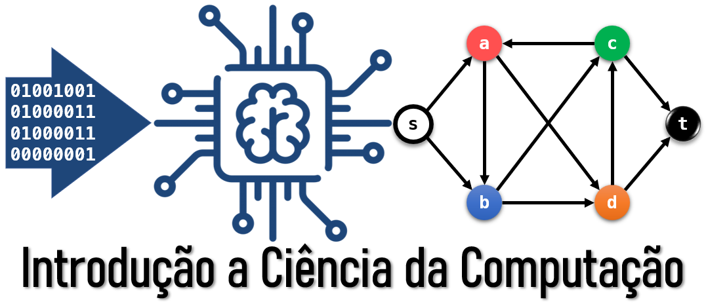
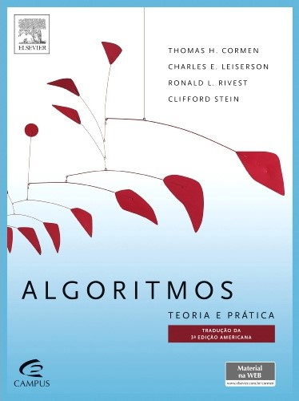

# 2026.1 - Introdução da Ciência da Computação 1

_Um algoritmo é qualquer procedimento computacional bem definido que toma algum valor ou conjunto de valores como entrada e produz algum valor ou conjunto de valores como saída.
Portanto, um algoritmo é uma sequência de etapas computacionais que transformam a entrada na saída. Também podemos considerar um algoritmo como uma ferramenta para resolver um problema computacional bem especificado.
O enunciado do problema especifica em termos gerais a relação desejada entre entrada e saída. O algoritmo descreve um procedimento computacional especifico para conseguir essa relação entre entrada e saída._

...

_Diz-se que um algoritmo é correto se, para toda instância de entrada, ele parar com saída correta. Dizemos que um Algoritmo correto resolve um problema computacional dado._

> **Referência Bibliográfica**:
> Cormen, T.; Leiserson, C. & Stein, R. (2012).
> _Algoritmos: teoria e pratica_.
> ELSEVIER EDITORA.
> ISBN 9788535236996.

