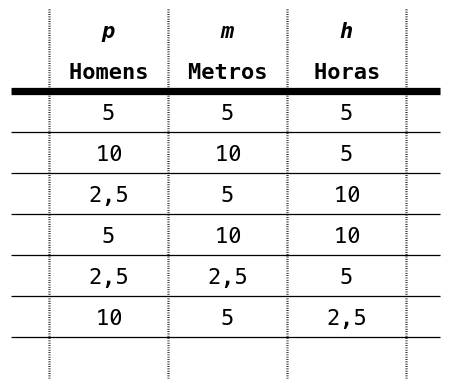

# 🧠 Quantos Cavadores?

Sabemos que cinco homens cavam uma vala de $5$ metros em $5$ horas.
Quantas cavadores serão necessários para cavar uma vala de $m$ metros em $h$ horas?

Desenvolva o algoritmo utilizando o **_Flowgorithm_** que solucione o problema proposto considerando as seguinte regras de entrada e saída esperada.



## 📥 Entrada

Seu algoritmo deverá receber os dados de entrada da seguinte forma:

Na 1° linha seu algoritmo deve receber um número inteiro $n$ correspondente ao números de vezes irá testar quantos homens serão necessários para cavar uma vala de $m$ metros em $h$ horas.

As demais $n$ linhas seu algoritmo deverá receber dois números $m$ e $h$ correspondente ao tamanho da vala (em metros) e ao tempo de cavação (em horas) respectivamente.

## 📤 Saída

Seu algoritmo deverá retornar para cada valor de $m$ e $h$ o número $p$ de cavadores necessários.

Os valores $p$ devem ser apresentados na mesma ordem que foram apresentados os valores de $m$ e $h$ e impressos um debaixo do outro.

Cada valor $p$ deve ter 1 casa decimal apenas.

## 🧪 Exemplos

### Input

```txt
6
5 5
10 5
5 10
10 10
2.5 5
5 2.5
```

### Output

```txt
5.0
10.0
2.5
5.0
2.5
10.0
```

# 🚚 Entrega

Arquivos que devem estar presenta na entrega:

```sh
├── a#
│   ├── p#
│   │   ├── 1.in
│   │   ├── 1.out
│   │   ├── main.{cpp|fprg|py}
│   │   ├── README.md
```


- A pasta `a#` refere-se à pasta das atividades, onde `#` representa o número da atividade. Por exemplo: `a1`, `a2`, `a3`, e assim por diante.

- A pasta `p#` refere-se à pasta dos problemas, onde `#` representa o número do problema. Por exemplo: `p1`, `p2`, `p3`, e assim por diante.

- O código de entrega deve ser nomeado `main.cpp` para soluções em C++ ou `main.fprg` para soluções em Flowgorithm, dependendo da linguagem especificada no enunciado do problema.

- O arquivo `1.in` é um arquivo de entrada utilizado para testar o código implementado.

- O arquivo `1.out` é um arquivo de saída gerado pelo código ao testar a entrada contida em `1.in`.

- O arquivo `README.md` deve conter o enunciado do problema.

> [!warning] Muita atenção
> Letras **maiúsculas** são diferente de letras **minúsculas**. Preste atenção no padrão de nome dos arquivos isso faz parte da avaliação.
