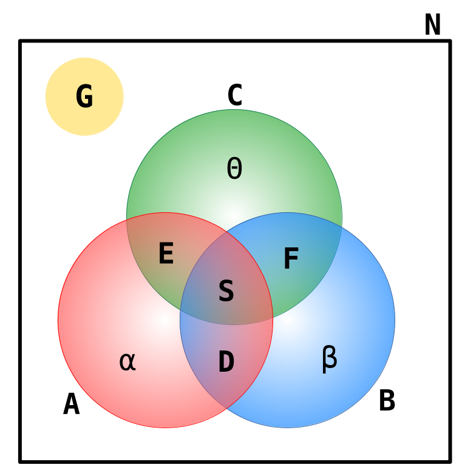

# 🧠 Clube dos Cinco





No Clube dos Cinco são oferecidos três esportes aos associados: tiro com arco, badminton e canoagem.

Cada associado pode participar de no máximo dois esportes, mas a administração do clube suspeita que algumas pessoas estejam ultrapassando esse limite.

A fim de descobrir a verdade, perguntaram aos treinadores quantas pessoas estavam frequentando suas aulas, resultando nos seguintes dados:

- O número $A$ de pessoas que praticam tiro com arco;
- O número $B$ de pessoas que praticam badminton;
- O número $C$ de pessoas que praticam canoagem.

Além disso, perguntaram aos membros quais esportes eles praticam. Obviamente, os associados que praticam três esportes mentiram, mas considere que outros falaram a verdade.

Os dados dos associados foram resumidos nas seguintes informações:

- O número $D$ de pessoas que praticam tiro com arco e badminton;
- O número $E$ de pessoas que praticam tiro com arco e canoagem;
- O número $F$ de pessoas que praticam badminton e canoagem;
- O número $G$ de pessoas que não praticam nenhum esporte.

Você ficou encarregado da a tarefa de descobrir se a suspeita é verdadeira.

Dados o número $N$ de associados do clube e os números $A, B, C, D, E, F$ e $G$ descritos acima, descubra se existe alguma pessoa que faz três esportes.

Desenvolva o algoritmo utilizando o **_Flowgorithm_** que solucione o problema proposto considerando a seguinte Entrada e Saída esperada:

## 📥 Entrada

A primeira linha contém um inteiros N, representando o número de associados.

A segunda linha contém sete inteiros A, B, C, D, E, F e G como descritos no enunciado.

## 📤 Saída

Seu programa deve produzir uma única linha, contendo uma única letra, "S" se algum associado participa de três esportes e "N", caso contrário.

## 🔒 Restrições

- $1 \le N \le 10^4$.
- $0 \le A, B, C, D, E, F, G \le N$.

## 🧪 Exemplos

### Input

```txt
7
4 4 4 1 1 2 0
```

### Output

```txt
S
```

---

### Input

```txt
8
4 4 4 1 1 2 0
```

### Output

```txt
N
```

---

### Input

```txt
10
4 4 4 1 1 1 1
```

### Output

```txt
N
```

---

### Input

```txt
7
4 4 4 1 1 1 1
```

### Output

```txt
S
```

---

### Input

```txt
10
4 4 4 0 0 0 1
```

### Output

```txt
S
```

# 🚚 Entrega

Arquivos que devem estar presenta na entrega:

```sh
├── a#
│   ├── p#
│   │   ├── 1.in
│   │   ├── 1.out
│   │   ├── main.{cpp|fprg|py}
│   │   ├── README.md
```


- A pasta `a#` refere-se à pasta das atividades, onde `#` representa o número da atividade. Por exemplo: `a1`, `a2`, `a3`, e assim por diante.

- A pasta `p#` refere-se à pasta dos problemas, onde `#` representa o número do problema. Por exemplo: `p1`, `p2`, `p3`, e assim por diante.

- O código de entrega deve ser nomeado `main.cpp` para soluções em C++ ou `main.fprg` para soluções em Flowgorithm, dependendo da linguagem especificada no enunciado do problema.

- O arquivo `1.in` é um arquivo de entrada utilizado para testar o código implementado.

- O arquivo `1.out` é um arquivo de saída gerado pelo código ao testar a entrada contida em `1.in`.

- O arquivo `README.md` deve conter o enunciado do problema.

> [!warning] Muita atenção
> Letras **maiúsculas** são diferente de letras **minúsculas**. Preste atenção no padrão de nome dos arquivos isso faz parte da avaliação.