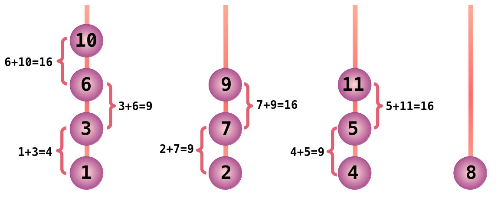

# 🧩 O Enigma das Bolas Mágicas

Durante séculos, o clássico desafio da **Torre de Hanoi** intrigou matemáticos e entusiastas de quebra-cabeças. Mas, como todo enigma, ele foi eventualmente dominado.

Com o mistério resolvido, as pessoas começaram a buscar novos desafios.
E foi então que surgiu **W. França**, um excêntrico inventor conhecido por sua obsessão por números perfeitos e enigmas matemáticos.

Senhor **W. França** apresentou ao mundo um novo jogo mágico, aparentemente simples, mas com uma regra que desafia a lógica comum.

## 🎲 A Regra do Jogo

Você recebe $N$ **hastes** verticais (como as da Torre de Hanoi) e uma **sequência infinita de bolas mágicas** numeradas com os inteiros positivos: $1, 2, 3, 4, 5, \cdots$

O objetivo é empilhar essas bolas nas hastes, respeitando a seguinte condição **mágica**:

> ⚠️ **Duas bolas só podem ficar em contato direto (uma sobre a outra) se a soma de seus números for um quadrado perfeito** (como $1, 4, 9, 16, 25, \cdots$).

Caso contrário, uma força mágica de repulsão será ativada, e a bola **não poderá ser colocada naquela haste**.

O jogador deve seguir estas regras:

1. As bolas são testadas **em ordem crescente**, começando pela bola de número 1.
2. A cada rodada, o jogador tenta colocar a nova bola no **topo de uma das hastes** já em uso, respeitando a regra mágica.
3. Se nenhuma haste existente permitir a colocação da bola, o jogador poderá iniciar uma nova haste (caso ainda haja hastes disponíveis).
4. Se a bola **não puder ser colocada em nenhuma haste** (nem nas que já têm bolas, nem nas vazias), o jogo termina.



## 🎯 Objetivo

O desafio é descobrir, para cada quantidade de hastes `N`, **quantas bolas no máximo é possível colocar** antes que o jogo se torne impossível de continuar.

## 📥 Entrada

A primeira linha da entrada contém um inteiro `T` — o número de casos de teste.  
Cada uma das `T` linhas seguintes contém um inteiro `N` — o número de hastes disponíveis para aquele caso.

## 📤 Saída

Para cada caso de teste, imprima uma linha com um único número:

- O número máximo de bolas que podem ser colocadas nas hastes com sucesso.

## 🔒 Restrições

- $1 \le T \le 50$
- $1 \le N \le 50$

## 🧪 Exemplos

### Input

```txt
2
4
25

```

### Output

```txt
::include{file=1.out}
```

---

### Input

```txt
::include{file=2.in}
```

### Output

```txt
::include{file=2.out}
```

---

### Input

```txt
::include{file=3.in}
```

### Output

```txt
::include{file=3.out}
```


