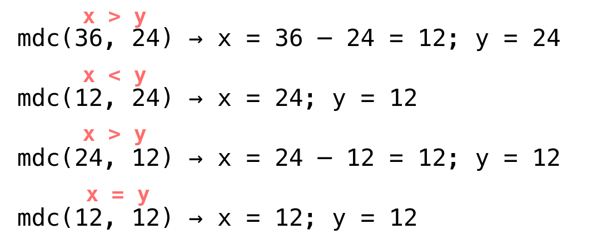

# 🧠 O Desafio dos Números Irmãos

No Reino da Aritmética, viviam dois irmãos muito peculiares: Axel e Bruno. Eles eram conhecidos em toda a terra por competirem constantemente para descobrir qual deles era o mais divisível. No entanto, havia uma tradição antiga e respeitada por todos: sempre que dois números queriam saber o que tinham em comum, consultavam o Oráculo do Máximo Divisor Comum – o sábio matemático do reino.

Mas esse oráculo era um tanto excêntrico. Em vez de dar a resposta diretamente, ele seguia um ritual recursivo:

- Se Axel fosse maior que Bruno, ele diminuía a si mesmo subtraindo o valor de Bruno, e o processo começava novamente.
- Se Bruno fosse maior, o papel se invertia.
- Quando ambos fossem iguais, o valor compartilhado por eles estaria revelado: esse era o MDC.

Agora, cabe a você implementar o papel do oráculo e resolver esse mistério matemático.

## 🧮 Fórmula

$$\text{mdc}(x, y) = \left\{ \begin{array}{cl} \text{mdc}(x - y, y) & : \ x > y \\ \text{mdc}(y, x) & : \ x < y \\ x & : \ x = y \end{array} \right.$$
\end{array} \right.$



## 📥 Entrada

A entrada consiste em duas linhas, cada uma contendo um número inteiro:

- A primeira linha contém um número inteiro $x$, tal que $1 \leq x \leq 10^4$
- A segunda linha contém um número inteiro $y$, tal que $1 \leq y \leq 10^4$

## 📤 Saída

Seu programa deve imprimir uma única linha contendo o valor do **MDC** dos dois números $x, y$ fornecidos.

## 🧪 Exemplos

### Input

```txt
36
24
```

### Output

```txt
12
```

