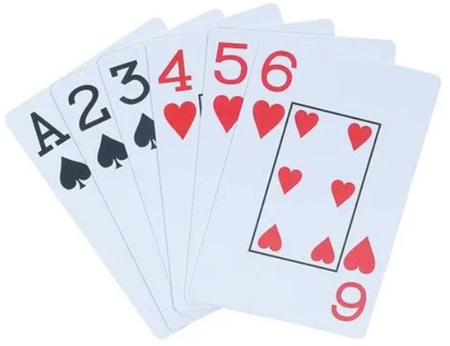

# 🧠 Cartas

Beatriz é uma entusiasta de jogos de cartas e gosta de utilizá-los como forma de exercitar a memória e o raciocínio lógico. Recentemente, ela criou um pequeno desafio com cartas como passatempo.

A brincadeira funciona da seguinte maneira: ela retira as cinco primeiras cartas do topo de um baralho bem embaralhado e as dispõe, em sequência, da esquerda para a direita, sobre a mesa, com as faces voltadas para baixo.

Em seguida, ela observa rapidamente cada uma das cartas, uma por vez, memorizando os seus valores, e as recoloca na mesa na mesma ordem, novamente com as faces voltadas para baixo.

Usando apenas a memória, Beatriz deve determinar se a sequência de cartas está ordenada em ordem **crescente**, **decrescente**, ou se **não apresenta uma ordenação** clara.

Com o tempo, porém, Beatriz começou a duvidar de sua própria memória e passou a questionar se suas respostas estavam corretas. Por isso, ela solicitou sua ajuda para desenvolver um programa que, dada a sequência de cinco cartas, determine automaticamente o tipo de ordenação presente.

## 📥 Entrada

A entrada consiste de uma única linha contendo cinco inteiros distintos entre $1$ e $13$, representando os valores das cartas na ordem em que foram dispostas sobre a mesa.

## 📤 Saída

Seu programa deve imprimir uma única letra maiúscula em uma linha:

- `C` se a sequência estiver ordenada **crescente**;
- `D` se estiver ordenada **decrescente**;
- `N` caso a sequência **não esteja ordenada**.

## 🧪 Exemplos

### Input

```txt
1 3 2 4 5
```

### Output

```txt
N

```

