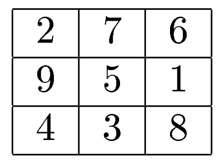
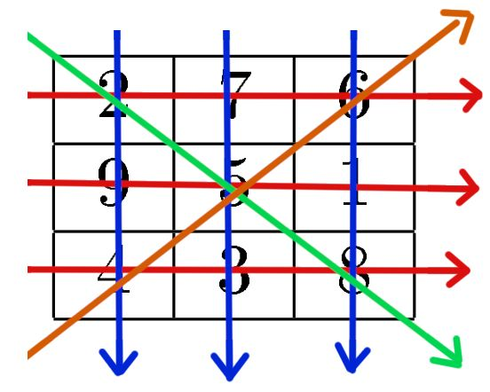

# 🧠 Quadrado Mágico

Arnaldo e Bernardo são dois garotos que compartilham um peculiar gosto por curiosidades matemáticas.

Nos últimos tempos, sua principal diversão tem sido investigar propriedades matemágicas de tabuleiros quadrados preenchidos com inteiros.

Recentemente, durante uma aula de matemática, os dois desafiaram os outros alunos da classe a criar quadrados mágicos, `que são quadrados preenchidos com números` de $1$ a $n^2$, de tal forma que a soma dos $n$ números em uma linha, coluna ou diagonais principais do quadrado tenham sempre o mesmo valor.

A ordem de um quadrado mágico é o seu número de linhas, e o valor do quadrado mágico é o resultado da soma de uma linha.

Um exemplo de quadrado mágico de ordem $3$ e valor de soma $15$ é mostrado na figura abaixo:

{height=200px}

Chama-se de quadrado mágico um arranjo, na forma de um quadrado, de $n \times n$ de números inteiros tal que todas as linhas, colunas e diagonais têm a mesma soma.

Sendo a uma matriz $A_{n \times n}$ um quadrado mágico de ordem $3$, o valor $15$, está presente em todas as somas das:

Para surpresa de Arnaldo e Bernardo, os outros alunos criaram um grande número de quadrados, alguns enormes, e alegaram que todos eram quadrados mágicos.

Arnaldo e Bernardo agora precisam de sua ajuda, para verificar se os quadrados criados são realmente mágicos.

Sua tarefa é escrever um programa que, dado um quadrado, determine se ele é magico ou não e qual a soma dele (caso seja mágico).

## 🧮 Fórmula



- Linhas:

  ${\Large \color{red} l_{k} = \sum_{i=1}^{n} A_{(k,i)}}$

  - ${\color{red} l_1 = 2 + 7 + 6 = 15}$
  - ${\color{red} l_2 = 9 + 5 + 1 = 15}$
  - ${\color{red} l_3 = 4 + 3 + 8 = 15}$

- Colunas:

  ${\Large \color{blue} c_{k} = \sum_{i=1}^{n} A_{(i,k)} }$

  - ${\color{blue} c_1 = 2 + 9 + 4 = 15}$
  - ${\color{blue} c_2 = 7 + 5 + 3 = 15}$
  - ${\color{blue} c_3 = 6 + 1 + 8 = 15}$

- Diagonais:

  ${\Large \color{green} d_1 = \bigg (\sum_{i=1}^{n}\sum_{j=1}^{n} A_{(i,j)} \bigg) \ \forall \ i = j}$

  - ${\color{green} d_1 = 2 + 5 + 8 = 15}$

  ${\Large \color{orange} d_2 = \bigg (\sum_{i=1}^{n}\sum_{j=1}^{n} A_{(i,j)} \bigg) \ \forall \ (n - j + 1) = i}$

  - ${\color{orange} d_2 = 4 + 5 + 6 = 15}$

A formula de verificação do quadrado magico consiste em verificar se:

${\Huge x = {\color{red} \sum_{n}^{k=2} (l_{k} - l_{k-1})} = {\color{blue} \sum_{n}^{k=2} (c_{k} - c_{k-1})} = {\color{green} d_1} - {\color{orange} d_2} = 0}$

Sendo $x$ **igual** a $0$ então é um _Quadrado Mágico_.

## 📥 Entrada

A primeira linha da entrada contém um único número inteiro $n$, indicando a ordem do quadrado (seu número de linhas).

As $n$ linhas seguintes descrevem o quadrado.

Cada uma dessas linhas contém $n$ números inteiros separados por um espaço em branco.

Cada valor separado por espaço deverá ser maior ou igual a $1$ e menor ou igual a $n^2$.

## 📤 Saída

Seu programa deve imprimir uma única linha.

Caso o quadrado seja mágico, a linha deve conter o valor do quadrado (ou seja, a soma de uma de suas linhas).

Caso contrário, a linha deve conter o número $0$.

## 🔒 Restrições

- $3 \le n \le 10^3$
- $1 \le A_{i,j} \le n^2$
- Para ser um quadrado mágico, o **maior** valor $A_{(i,j)}$ deve ser **igual** a $n^2$.

## 🧪 Exemplos

### Input

```txt
3
2 7 6
9 5 1
4 3 8

```

### Output

```txt
15
```

