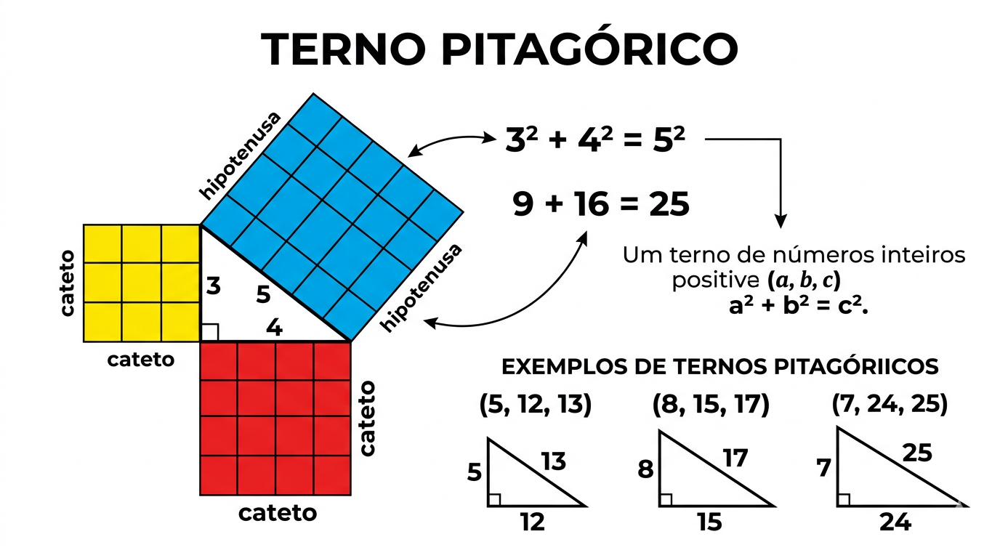

# 🧠 Termo Pitagórico

Faça um programa que calcule o terno pitagórico a, b, c, para o qual $a + b + c = n$.

Um terno pitagórico é um conjunto de três números naturais, a, b, c, para a qual, $a^2 + b^2 = c^2$

Por exemplo, $3^2 + 4^2 = 9 + 16 = 25 = 5^2$

## 📥 Entrada

Seu programa receberá um valor **inteiro** $n$.

## 📤 Saída

Devem ser impressos três valores inteiros, respectivamente $a$, $b$ e $c$.  
Caso não exista solução inteira imprima a mensagem "**Nao existe resposta**".

## 🧪 Exemplos

### Input

```txt
12

```

### Output

```txt
3 4 5

```

