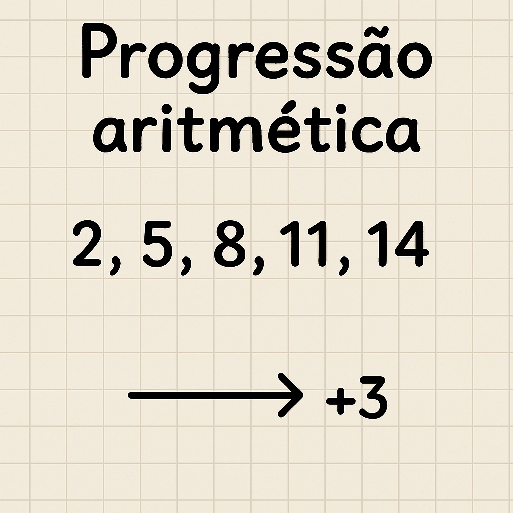

{height=200px}

# 🧠 Encontrando Progressões Aritméticas

A **progressão aritmética** (PA) é uma sequência de valores que apresenta uma diferença constante entre números consecutivos.

Uma progressão aritmética é uma sequência formada por termos que se diferenciam um do outro por um valor constante, que recebe o nome de razão, calculado por:

- $r = a_2 - a_1$

Onde:

- $r$ é a razão de uma PA.
- $a_2$ é o segundo termo de uma PA.
- $a_2$ é o primeiro termo de uma PA.

Sendo assim, os termos de uma progressão aritmética podem ser escritos da seguinte forma:

$PA = a_1, (a_1 + r), (a_1 + 2r), (a_1 + 3r), \cdots, [a_1 + (n -1)r]$

Note que em uma PA de $n$ termos a fórmula do termo geral ($a_n$) da sequência é:

$a_n = a_1 + (n - 1)r$

Em uma sequência de números ordernado, podemos gerar diversas PA's observando se a diferença entre números consecutivos é sempre a mesma.
Por exemplo, "$2, 3, 4, 5$", "$10, 7, 4$" e "$10, 8, 6, 4, 2$" são PA's.

Dada uma sequência de números, queremos determinar quantas PA's existem.
Mas só estamos interessados em PA's tão longas quanto possível.
Por isso, se uma PA é um pedaço de outra, consideramos somente a maior.
Por exemplo:

Na sequência "$1, 1, 1, 3, 5, 4, 8, 12$" temos $4$ PA's diferentes:

- $\{1, 1, 1\}, r = 0$
- $\{1, 3, 5\}, r = 2$
- $\{5, 4\}, r = -1$
- $\{4, 8, 12\}, r = 4$"

## 📥 Entrada

1. A primeira linha da entra contém um inteiro $N$ indicando o tamanho da sequência de números.
2. A segunda linha contém $N$ inteiros $a_i$ definindo a sequência.

## 📤 Saída

Imprima uma linha contendo um inteiro representando quantas PA's existem na sequência

## 🔒 Restrições

- $1 \le N \le 10^3$
- $-100 \le a_i \le 100$

## 🧪 Exemplos

### Input

```txt
::include{file=1.in}
```

### Output

```txt
::include{file=1.out}
```

---

### Input

```txt
::include{file=2.in}
```

### Output

```txt
::include{file=2.out}
```

---

### Input

```txt
::include{file=3.in}
```

### Output

```txt
::include{file=3.out}
```

# 🚚 Entrega

::include{file=../entregaveis.md}
