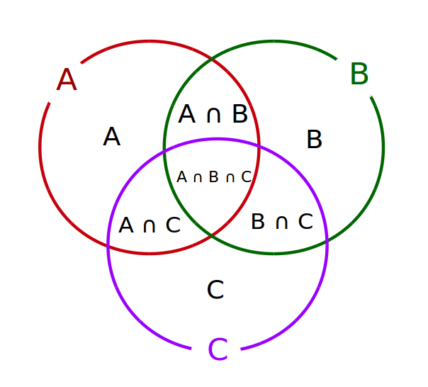

{height=300px}

# 🧠 Numeros de subconjuntos com dois ou mais elementos

Todo número inteiro positivo pode ser escrito como um produto de potências de números primos.
Por exemplo, temos: $252 = 2^{2} \times 3^{2} \times 7$

Nesse caso, os primos distintos que aparecem na decomposição fazem parte do conjunto dos primos distintos associados à fatoração do número $n$.

A teoria dos conjuntos nos oferece ferramentas para calcular a quantidade de subconjuntos possíveis de um conjunto dado.
Por exemplo, considerando o conjunto $A = \{2, 3, 7\}$ podemos formar os seguintes subconjuntos:

$$
\{ \}, \{2\}, \{3\}, \{7\}, \{2, 3\}, \{2, 7\}, \{3, 7\}, \{2, 3, 7\}
$$

Observe que o total de subconjuntos formados é igual a $8$.
Isso ocorre porque, dado um conjunto com $n$ elementos, a quantidade total de subconjuntos possíveis é $2^n$.
No exemplo acima, como o conjunto possui $3$ elementos, temos $2^3 = 8$ subconjuntos.

O método mais rápido para calcular subconjuntos é usando $2^n$, em que $n$ é a quantidade de elementos que tem o conjunto dado.

No caso acima, o conjunto dado tem $3$ elementos, logo, substituímos o $n$ por $3$, onde $2^3 = 8$ subconjuntos.

Para sabermos quantos subconjuntos possuem pelo menos $2$ elementos, temos que calcular $S(k)$.
Onde $S(k) = 2^k - k - 1$

## 📥 Entrada

A entrada consiste de uma única linha que contém um inteiro $N (1 \le N \le 10^{3})$.

## 📤 Saída

Seu programa deve produzir uma única linha com um inteiro representando o número de subconjuntos com pelo menos $2$ elementos.

## 🧪 Exemplos

### Input

```txt
252
```

### Output

```txt
4
```

---

### Input

```txt
6469693230
```

### Output

```txt
1013
```

---

### Input

```txt
378
```

### Output

```txt
4
```

---

### Input

```txt
28
```

### Output

```txt
1
```

---

### Input

```txt
17
```

### Output

```txt
0
```

---

### Input

```txt
88290298627
```

### Output

```txt
0
```

# 🚚 Entrega

::include{file=../entregaveis.md}
